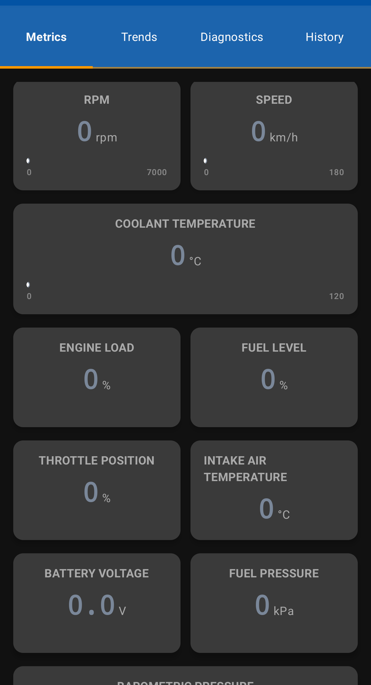
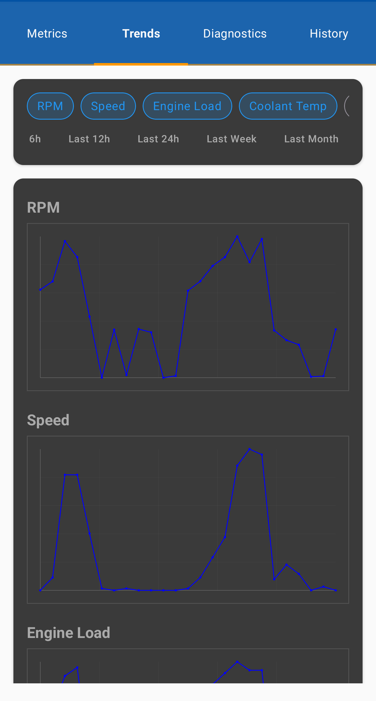
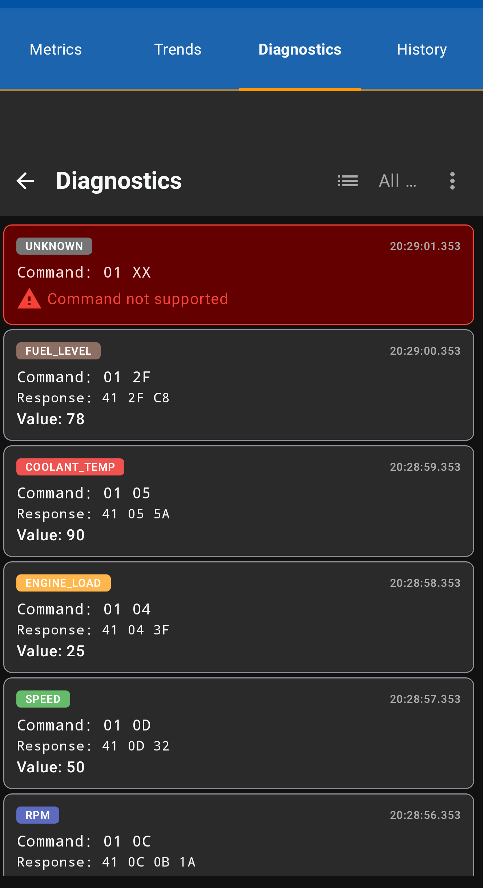

# DriveVitals

### Your Vehicle's Digital Dashboard & Diagnostics Companion

  

 

## 🚗 About DriveVitals

DriveVitals transforms your Android device into a powerful automotive dashboard, connecting to your vehicle's OBD-II port to provide real-time metrics and basic diagnostics. Whether you're a car enthusiast wanting to monitor your engine's vital statistics or a DIY mechanic diagnosing issues, DriveVitals offers an intuitive interface for viewing your vehicle's data.

## 🔒 Privacy First

DriveVitals is built with privacy as a core principle:

* **No Account Required** - Use the app without creating any account or signing up
* **No Data Collection** - No tracking, collection, or transmission of your vehicle data
* **No Analytics** - No usage tracking or analytics frameworks
* **No Advertisements** - Zero ads or third-party tracking
* **100% Local Storage** - All your data stays on your device
* **No Internet Required** - Works completely offline after installation

Your vehicle data belongs to you alone. Period.

|Real-time Metrics Dashboard|Trends View|Diagnostics View
|:-------------------------:|:----------------------:|:----------------------:|
||||

## ✨ Key Features

### 📊 Comprehensive Metrics Dashboard
* **Real-time Engine Stats**: RPM, speed, engine load, and throttle position
* **Temperature Monitoring**: Coolant and intake air temperature
* **System Status**: Fuel level, fuel pressure, barometric pressure, and battery voltage
* **Customizable Layout**: Arrange metrics in your preferred dashboard configuration

### 📈 Data Visualization
* **Basic Graphs**: View trends of your vehicle's parameters
* **Historical Data**: See how metrics change over time

### 🔧 Basic Diagnostics
* **OBD-II Error Codes**: Read diagnostic trouble codes
* **Log Viewer**: View basic communication logs with your vehicle's ECU
* **Data Recording**: Save session data for later analysis

### 📱 Modern Android Experience
* **Material Design**: Clean, intuitive interface
* **Jetpack Compose UI**: Responsive layouts for various screen sizes
* **Tab-based Navigation**: Easy access to different functionality

## 🛠️ Requirements

* Android 8.0 (API level 26) or higher
* Bluetooth-enabled Android device
* OBD-II compatible vehicle (generally all cars made after 1996 in the US, 2001 in the EU, and 2008 globally)
* ELM327-based Bluetooth OBD-II adapter (widely available for $10-30)

## 🚀 Getting Started

1. **Connect your OBD-II adapter**
   * Plug the adapter into your vehicle's OBD-II port (typically under the dashboard)
   * Turn on vehicle ignition (engine doesn't need to be running)

2. **Pair with Bluetooth**
   * Pair your Android device with the OBD-II adapter in your Bluetooth settings
   * Default PIN is often `0000` or `1234`

3. **Launch DriveVitals**
   * Open the app and tap the connection button in the top right
   * Select your paired OBD-II adapter
   * Accept the requested permissions

4. **Start monitoring**
   * Once connected, your vehicle's metrics will appear on the dashboard
   * Customize your view using the settings menu

### What's In Development
🔄 **Gemini AI Integration** - Advanced diagnostics and predictive maintenance using Google's Gemini AI  
🔄 Enhanced diagnostic trouble code (DTC) interpretation  
🔄 Trip logging and analysis  
🔄 Fuel economy calculations  
🔄 Expanded vehicle compatibility testing  
